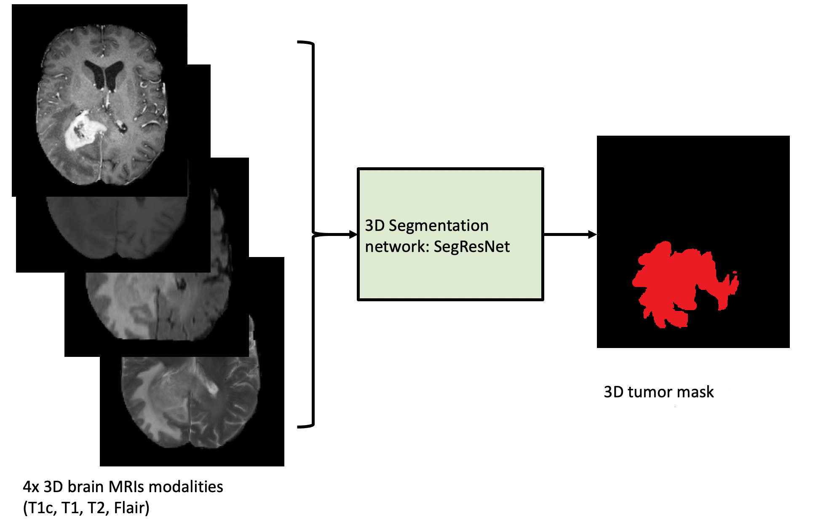
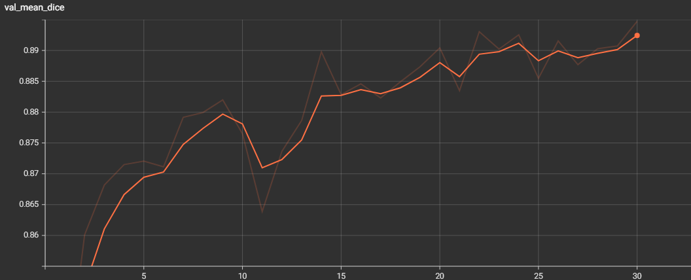

# Introduction

This repository presents an end-to-end deep learning pipeline for brain tumor segmentation developed using the [MONAI](https://monai.io/) framework and multimodal structural MRI data from the [Brain Tumor Segmentation Challenge 2021](http://braintumorsegmentation.org/). The BraTS challenges provide a standardized benchmark for evaluating automated methods that segment glioma subregions from multimodal MRI acquisitions, enabling comparison of modern medical imaging segmentation techniques.

Rather than focusing on maximizing segmentation performance, this project emphasizes the complete lifecycle of a medical AI solution, including:

- Dataset organization and preprocessing
- Model training and validation
- Quantitative evaluation
- Model inference
- Model deployment through containerization.

The implementation demonstrates how MONAI can be used to build research-grade medical imaging pipelines that remain modular and reproducible, even under limited computational resources. Particular attention is given to practical engineering considerations such as standardized preprocessing, transfer learning, experiment management, and portable inference using Docker.

⚠️ Disclaimer:
This project is provided for research and educational purposes only and is not intended for clinical diagnosis or medical decision-making.


<div style="text-align: center;">
  
</div>

# Tools

For this project I used the following tools:

* Poetry
* MONAI
* PyTorch
* Docker


## Setting up the virtual environment
To ensure a clean and isolated workspace for this project, it is recommended to create a virtual environment with **poetry**, which can be installed using pip. 

```powershell
pip install poetry
```

To create the virtual environment inside the project directory, you must configure poetry to use in-project virtual environments.

```powershell
poetry config virtualenvs.in-project true
```

To install dependencies and create the environment run: 

```powershell
poetry install
```

Once the environment is installed, it can be activated be running:

```powershell
.venv\Scripts\Activate.ps1
```

# Dataset

The dataset consist of 500 multi-institutional pre-operative baseline brain MRI scans in NIfTI format ,namely: T1 weighted images (T1), T2 weighted images (T2), fluid attenuated inversion recovery T2 weighted images (FLAIR) and T1 weighted images with contrast enhancement (T1-CE). The images were manually annotated by several raters following the same annotation protocol, and their annotations were approved by experienced neuro-radiologists. Annotations comprise the GD-enhancing tumor (ET — label 4), the peritumoral edematous/invaded tissue (ED — label 2), and the necrotic tumor core (NCR — label 1). Images were skull-stripped, aligned and resampled to a common resolution of 240x240x155 which correspond to a isotropic $1 mm^3$ voxel. Out of the 500 images selected, 400 were used for training the model and the remaining 100 for testing purposes. The training dataset was further randomly split into 320 (80%) images for training and 80 (20%) for validation. To simplify the problem formulation, the annotated tumor subregions were merged into a single mask, converting the task into a binary tumor segmentation problem.

<div style="text-align: center;">
  
</div>

Dataset structure has the following hierarchy:

```text
BraTS2021/
├── Training/
│   ├── FLAIR/
│   │   ├── BraTS2021_00006_flair.niigz
│   │   ├── BraTS2021_00011_flair.nii.gz
│   │   └── ...
│   ├── T1/
│   │   ├── BraTS2021_00006_t1.nii.gz
│   │   ├── BraTS2021_00011_t1.nii.gz
│   │   └── ...
│   ├── T2/
│   │   ├── BraTS2021_00006_t2.nii.gz
│   │   ├── BraTS2021_00011_t2.nii.gz
│   │   └── ...
│   ├── T1CE/
│   │   ├── BraTS2021_00006_t1ce.nii.gz
│   │   ├── BraTS2021_00011_t1ce.nii.gz
│   │   └── ...
│   └── Labels/
│       ├── BraTS2021_00006_seg.nii.gz
│       ├── BraTS2021_00011_seg.nii.gz
│       └── ...
│
└── Testing/
    ├── FLAIR/
    │   ├── BraTS2021_00006_flair.niigz
    │   ├── BraTS2021_00011_flair.nii.gz
    │   └── ...
    ├── T1/
    │   ├── BraTS2021_00006_t1.nii.gz
    │   ├── BraTS2021_00011_t1.nii.gz
    │   └── ...
    ├── T2/
    │   ├── BraTS2021_00006_t2.nii.gz
    │   ├── BraTS2021_00011_t2.nii.gz
    │   └── ...
    ├── T1CE/
    │   ├── BraTS2021_00006_t1ce.nii.gz
    │   ├── BraTS2021_00011_t1ce.nii.gz
    │   └── ...
    └── Labels/
        ├── BraTS2021_00006_seg.nii.gz
        ├── BraTS2021_00011_seg.nii.gz
        └── ...
``` 

## Data Preprocessing

NIfTI files were preprocessed using MONAI's dictionary transforms, which makes it easy to prepare medical images of different modalities for training. The transformations listed below, ensure our model sees consistent input for all different subjects in our dataset:

* Channel First: Moves the channel dimension to the first position.
* Channel Concatenation: Concatenates the different structural MRI modalities along the channel dimension to create a 4-dimensional input tensor.
* Channel Deletion: Deletes the concatenated modalities to save memory.
* Label Mapping: Maps all the subregion labels to a single label to create a binary mask.
* Orientation: Aligns image coordinate system to match LPS (*Left-Superior-Posterior*) coordinate system, so axes become:
  * X → Left
  * Y → Posterior
  * Z → Superior
* Resizing: Interpolates voxel values to a common fixed tensor shape of (240x240x155).
* Intensity Normalization: Normalize voxel intensities to remove intensity variability across scans.

## Data Augmentation

To improve model's robustness to orientation, intensity variability, and noise, data augmentation was performed using random transformations:
* Flips along all axis
* Image intensity shifting
* image intensity scaling
* Gaussian noise addition

# Segmentation Model

The segmentation model is [SegResNet](https://arxiv.org/abs/1810.11654), which is an encode-decoder based semantic segmentation network with deep supervision . The encoder part uses ResNet blocks with instance normalization. The number of input channels are for, namely the DWI and ADC images concatenated in the channel dimension. The single output channel is the tumor segmentation mask. Four stages of down-sampling were used, each with 1, 2, 2 and 4 convolutional blocks, respectively. Each block’s output is followed by an additive identity skip connection. Three stages of up-sampling were used each with 1  convolutional block. All 3D convolutions are 3x3x3 with an initial number of filters equal to 16. The decoder structure is similar to the encoder one, but with a single block per each spatial level. The end of the decoder has the same spatial size as the original image, and the number of features equal to the initial input feature size, followed by a 1x1x1 convolution and a softmax. The resulting model architecture contains approximately 4.7 million parameters. 

This model architecture was succesfully used for brain tumor segmentation in the [Multimodal Brain Tumor Segmentation Challenge BraTS2018](https://www.med.upenn.edu/sbia/brats2018.html), achieving very good performance in terms of Dice coefficient for three different tumor regions. To accelerate model convergence, the pretrained weights from this network can be used to initialize the binary tumor segmentation model through transfer learning. In this setup, only the weights of the output layer need to be adapted to match the new number of output channels—for instance, by initializing them with the mean of the pretrained weights across channels. Furthermore, the encoder can be frozen during training, meaning its weights are kept fixed while only the decoder and output layers are updated. This preserves the feature representations learned from the original BraTS2018 dataset—such as MRI-specific textures and anatomical patterns—while significantly reducing the number of trainable parameters. Freezing the encoder lowers memory usage, speeds up backpropagation, and shortens training time, making it possible to fine-tune the model on a standard personal computer without sacrificing the benefits of the pretrained feature extractor.

# Model Training

Model training and validation were implemented MONAI's event-driven training engines based on PyTorch-Ignite. The engine manage the training/validation loop, and metric computation in a standardized and reproducible manner. Built-in handlers were used for checkpointing, early stopping, logging, and learning rate scheduling, ensuring consistent experiment management across runs. By using MONAI engines you can reduce boilerplate code and minimize implementation errors commonly associated with custom training loops, while maintaining full compatibility with PyTorch. 

The training dataset, as mentioned above, consist of 400 images located in the `/BraTS2021/Training` folder, randomly extracted from the original BraTS2021 dataset and organized into the file structure showed in [Dataset](#dataset) section. A reduced batch size was chosen due to limited computing resources. Adam optimizer was utilized with a learning rate of 1e-4 and weight decay of 1e-5 to impose $L_{2}$ regularization.

## Parameters

- **Device:** CPU 
- **Epochs:** 100
- **Batch Size:** 2

These training parameters can be adjusted ,depending on computational resources available. To run the training pipeline from scratch (no transfer learning) with default parameters, execute:

```powershell
python .\scripts\training.py --root_dir "path/to/root/folder" 
```
In case of transfer learning, execute:

```powershell
python .\scripts\training.py --root_dir "path/to/root/folder" --pretrained_path "path/to/pretrained_model.pt" 
```

In case of transfer learning with frozen encoder, execute:

```powershell
python .\scripts\training.py --root_dir "path/to/root/folder" --pretrained_path "path/to/pretrained_model.pt" --freeze_encoder=True
```

## Loss Function

Dice loss is a loss function commonly used in medical image segmentation tasks. It is derived from the Dice Similarity Coefficient (DSC), which measures the overlap between two sets — usually the predicted segmentation and the ground truth mask. The Dice loss is defined as:

$$
\mathcal{L}_{Dice}= 1 - \frac{2 |P \cap G|}{|P| + |G|}
$$

Where:  
- $P$ = predicted mask  
- $G$ = ground truth mask  
- $|P \cap G|$ = number of overlapping voxels  
- $|P|$ and $|G|$ = number of voxels predicted and ground truth masks

## Training Results

After training for 30 epochs the model achieves a validation Dice coefficient of **0.895**, indicating a high degree of overlap between the predicted masks and the ground truth annotations. This suggests that the model is able to accurately identify and delineate tumor regions in the MRI scans. A Dice score close to 0.9 demonstrates strong segmentation performance and indicates that the model’s predictions are highly consistent with expert-annotated masks, making it a reliable tool for research and technical demonstrations of glioma segmentation using MONAI. The training was stopped at this moment due to time and resource constraints, but it can be trained for more epochs to see if this metric improves.

<div style="text-align: center;">
  
</div>

# Model Evaluation

For evaluation purposes, 100 additional images from the original BraTS2021 dataset were randomly selected from the `/BraTS2021/Testing` folder and reorganized following the directory structure described in the [Dataset](#dataset) section. Model performance was assesed using the **Dice coefficient**, and the resulting score was saved as a .csv file in the `/results` folder.

## Parameters

- **Device:** CPU 
- **Batch Size:** 2
- **Evaluation metric:** Dice coefficient 

To run the evaluation pipeline with default parameters execute:

```powershell
python .\scripts\evaluation.py --root_dir "path/to/root/folder" 
```

# Model Inference

Model inference can be used to generate tumor segmentation masks for **new MRI scans**. The inference pipeline expects the same four MRI modalities used during training (FLAIR,T2,T1,T1CE) and follow the same folder structure described in the [Dataset](#dataset) section. These new images must be aligned, skull-stripped and resample to a common resolution of 240x240x155. The trained model then produces a **binary tumor segmentation mask** for each subject in NIfTI (`.nii.gz`) format. 

## Parameters

- **Device:** CPU 
- **Batch Size:** 1  

To run the inference pipeline with default parameters on new images, execute:

```powershell
python .\scripts\inference.py --dataset_dir "path/to/dataset/folder"
```

The segmentation results will be stored in `./segm_dir` and they can be visualized with neuroimaging tools like **ITK-SNAP** or **3D Slicer**. 

# Docker Container

To facilitate reproducible and portable inference results, the inference pipeline is provided as a Docker container. This allows using the model without installing Python, MONAI, or PyTorch locally. The pipeline is packaged as the following Docker image, which can be downloaded from **Docker Hub**: 

```text
docker pull israrm88/tumor-segmentation:latest
```
If you want to build your own image locally, navigate to the folder containing the Dockerfile, and execute he following command:

```powershell
docker build -t your_image_name:your_image_tag .
```

To execute the inference pipeline, run the following command:

```powershell
docker run --rm `
  -v "path/to/test/image/folder:/data" `
  -v "path/to/output/segmentation/folder:/output" `
  israrm88/tumor-segmentation:latest `
  --dataset_dir /data `
  --segm_dir /output 
```
Below is a Docker command breakdown to describe each flag's funcionality. 

#### Docker flags

```powershell
docker run --rm `
  -v "path/to/test/image/folder:/data" `
  -v "path/to/output/segmentation/folder:/output" `
  israrm88/tumor-segmentation:latest `
```

* **docker run** : Creates and starts a new container from a Docker image.

* **--rm**: Automatically removes the container once execution finishes. This prevents accumulation of stopped containers and keeps the system clean.

* **-v `path/to/test/image/folder:/data`** : Mounts a host directory containing the input dataset(`path/to/test/image/folder`) into the container as a volume (`:/output`) where the input data will be accessible. The container reads MRI data from `/data` without copying files into the image.

* **-v `path/to/output/segmentation/folder:/output`** : Mounts a second directory where segmentation masks will be written(`path/to/output/segmentation/folder`) into the container as a volume (`:/output`) used to save segmentation outputs. Generated NIfTI segmentation masks persist after the container exits.

* **israrm88/tumor-segmentation:latest**: Docker image identification: username (*israrm88*), image name (*tumor-segmentation*) and tag name (*latest*).

#### Application flags

```powershell
  --dataset_dir /data `
  --segm_dir /output `
```

* **--dataset_dir /data** : Directory containing the input dataset inside the container passed to the container's entrypoint script. Matches the volume mount defined earlier (`/data`).

* **--segm_dir /output** : Optional directory defining where segmentation results are saved pointing to the output directory inside the container. Corresponds to the mounted host output folder (`/output`). Defaults to the current working directory. 

# Conclusions

This project demonstrates the development of an end-to-end deep learning pipeline for brain tumor segmentation from multimodal MRI using the MONAI framework. The implementation covers all key stages of a medical imaging workflow, including dataset organization, preprocessing, data augmentation, model training, evaluation, inference, and deployment. From a learning perspective, the project highlights the importance of consistent preprocessing for multimodal MRI data, the use of 3D convolutional architectures such as SegResNet for volumetric segmentation, and the practical benefits of transfer learning and encoder freezing to reduce computational cost. The use of MONAI’s event-driven training engines simplifies experiment management and improves reproducibility, while containerizing the inference pipeline with Docker enables portable and consistent deployment across environments. Achieving a validation Dice coefficient of **0.89**, the model demonstrates strong segmentation performance for the simplified binary tumor segmentation task and illustrates how modern deep learning tools can be integrated into a structured and reproducible medical imaging workflow.

While there is considerable room for improvement regarding architectural design, task-specific refinements and GPU optimization, the central aim was to present a reproducible end-to-end deep learning solution for a medical imaging problem rather than achieving state-of-the-art performance on a specific task. The project illustrates how a medical AI solution can be structured, implemented, and reproduced, providing a foundation that can be extended, optimized, or adapted to other imaging problems.